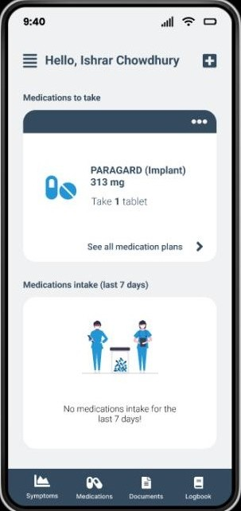

# HealthHive

HealthHive is a personal health record system that lets patients store their medical records digitally and share them with doctors when needed. It also includes features like medication reminders and health tracking to help users manage their daily health better.

## Overview

Carrying physical copies of prescriptions and reports can be messy and inconvenient. HealthHive is a digital system that helps users keep all their medical documents and health data in one place. Doctors can access the information with the patient’s permission, using a one-time code.

## Current Features

### For Patients

- **Register and log in**
- **Create and update profile** (name, DOB, gender, blood group, etc.)
- **Upload documents** like prescriptions, lab reports, etc.
- **Track vitals**: blood pressure, sugar, temperature, weight, height, hydration, menstruation
- **Add medications** with reminders
- **Report symptoms** with descriptions and timestamps

### For Doctors

- Log in using OTP or code provided by patient  

## Interfaces

- Patient  
- Doctor  

## Tech Stack

| Area               | Language/Framework                     |
|--------------------|-------------------------------|
| Mobile App         | Flutter            |
| Backend            | Node.js                       |
| Database           | MySQL              |
| Languages Used     | JavaScript, Dart      |

---

## Preview

## Development

The project was developed by me and Rabbani2019331039 for our Database Systems Lab during our undergrad 3rd year.

